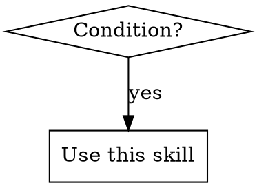

{{!--
SKILL.md Template - agentskills.io Compliant

This template follows the agentskills.io specification:
https://agentskills.io/specification

Token Budget:

- Frontmatter: ~100 tokens (name + description for XML injection)
- Body: <5000 tokens recommended (~500 lines max)
- Use references/ for deep dives that load on demand

Directory Structure (recommended):
skill-name/
├── SKILL.md # Required - this file
├── references/ # Optional - deep-dive docs
│ ├── patterns/ # Pattern documentation
│ └── troubleshooting/ # Problem-solving guides
├── scripts/ # Optional - executable utilities
├── assets/ # Optional - images, diagrams, templates
└── examples/ # Optional - runnable demos
--}}

---

name: {{skill_name_kebab}}
{{!--
REQUIRED. Max 64 chars. Constraints:

- Lowercase letters, numbers, and hyphens only (a-z, 0-9, -)
- Must not start or end with hyphen
- No consecutive hyphens (--)
- Must match parent directory name
  --}}
  description: Use when {{triggering_conditions}}
  {{!--
  REQUIRED. Max 1024 chars. Guidelines:
- Start with "Use when..." to focus on triggering conditions
- Describe WHEN to use (symptoms, situations), not WHAT it does
- Include keywords agents search for (error messages, symptoms)
- Do NOT summarize the workflow (causes agents to skip reading body)
- Write in third person (injected into system prompt)
- Aim for ~150 chars, max 1024
  --}}
  {{#if license}}
  license: {{license}}
  {{!-- Optional. License name or reference to bundled LICENSE file --}}
  {{/if}}
  {{#if compatibility}}
  compatibility: {{compatibility}}
  {{!-- Optional. Max 500 chars. Environment requirements (Python version, dependencies, network access) --}}
  {{/if}}
  {{#if metadata}}
  metadata:
  {{!--
    Optional. For tooling-specific fields only.
    Do NOT duplicate name/description here.
    Common fields: author, version, tags
  --}}
  {{#each metadata}}
  {{@key}}: {{this}}
  {{/each}}
  {{/if}}
  {{#if allowed_tools}}
  allowed-tools: {{allowed_tools}}
  {{!-- Optional. Space-delimited list of pre-approved tools. Experimental. --}}
  {{/if}}

---

{{!-- Body: <5000 tokens recommended. Move detailed content to references/ --}}

# {{skill_name}}

## Overview

{{overview_description}}

{{!-- Core principle in 1-2 sentences. What IS this skill? --}}

## When to Use

{{!-- Optional: Include decision flowchart for non-obvious decisions



--}}

**Use when:**
{{#each use_when}}

- {{this}}
  {{/each}}

**When NOT to use:**
{{#each not_use_when}}

- {{this}}
  {{/each}}

## Quick Reference

{{!-- Table format for agent scanning. Include searchable keywords. --}}

| Problem | Solution | Keywords |
| ------- | -------- | -------- |

{{#each quick_reference}}
| {{problem}} | {{solution}} | {{keywords}} |
{{/each}}

## Core Patterns

{{!-- Use ❌ Bad / ✅ Good code comparison pattern --}}

### {{pattern_name}}

**The problem:** {{problem_description}}

**❌ Common mistake:**

```{{language}}
{{bad_example}}
```

**✅ Production pattern:**

```{{language}}
{{good_example}}
```

**Key insight:** {{key_insight}}

{{!-- Add more patterns as needed. Keep inline if <50 lines, else move to references/ --}}

## Common Mistakes

| Mistake | Why It's Wrong | Fix |
| ------- | -------------- | --- |

{{#each common_mistakes}}
| {{mistake}} | {{why_wrong}} | {{fix}} |
{{/each}}

## Red Flags

{{!-- Stop signs - when to reconsider approach --}}

{{#each red_flags}}

- {{this}}
  {{/each}}

**All of these mean: Revisit your approach before proceeding.**

{{#if real_world_impact}}

## Real-World Impact

{{!-- Optional: Concrete metrics showing skill value --}}

{{#each real_world_impact}}

- {{this}}
  {{/each}}
  {{/if}}

---

## Validation

```bash
# agentskills.io standard validation
skills-ref validate ./{{skill_name_kebab}}

# skill-fleet project validation
uv run skills-fleet validate-skill path/to/{{skill_name_kebab}}
```
