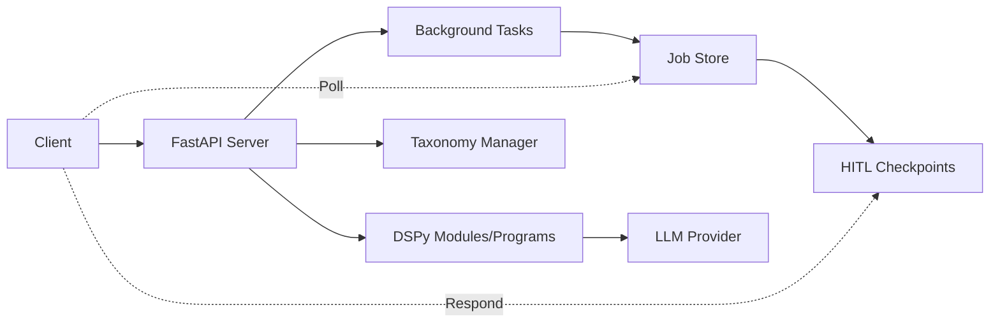

# API Documentation

**Last Updated**: 2026-01-26
**Location**: `src/skill_fleet/api/`

## Overview

The Skills Fleet FastAPI REST API provides programmatic access to the skill creation workflow, taxonomy management, and validation services. The API supports asynchronous skill creation with Human-in-the-Loop (HITL) interactions through a job-based architecture.

`★ Insight ─────────────────────────────────────`
The API uses a **job-based pattern** for long-running skill creation. Instead of blocking HTTP requests, skills are created in background jobs. Clients poll for status and respond to HITL checkpoints via separate endpoints, making the API suitable for web UIs and webhooks.
`─────────────────────────────────────────────────`

## API Version

Skills Fleet has a single API version:

| Version | Status | Base Path | Documentation |
|---------|--------|-----------|---------------|
| **v1** | ✅ Current/Stable | `/api/v1/` | [Endpoints](endpoints.md) |

The v1 API provides the complete skill creation, taxonomy management, validation, and HITL workflow functionality.

## Quick Start

```bash
# Start the API server
uv run skill-fleet serve --port 8000

# Or using uvicorn directly
uvicorn skill_fleet.api.main:app --reload --port 8000
```

The API will be available at `http://localhost:8000`

- **OpenAPI docs**: `http://localhost:8000/docs`
- **ReDoc**: `http://localhost:8000/redoc`
- **Health check**: `http://localhost:8000/health`

## API Architecture



### Key Components

| Component | Description | File |
|-----------|-------------|------|
| **FastAPI App** | Application factory with CORS, route registration | `factory.py` + `main.py` |
| **Skills Routes** | Skill creation endpoints | `api/v1/skills/router.py` |
| **HITL Routes** | Human-in-the-Loop endpoints | `api/v1/hitl/router.py` |
| **Taxonomy Routes** | Taxonomy management endpoints | `api/v1/taxonomy/router.py` |
| **Quality Routes** | Skill validation endpoints | `api/v1/quality/router.py` |
| **Job System** | Background job management | `services/job_manager.py` |

## Base URL

```
http://localhost:8000/api/v1
```

All endpoints are prefixed with `/api/v1` for versioning.

## Authentication

Currently, the API does not enforce authentication. For production use, you should:

1. Add API key middleware
2. Implement OAuth2/JWT authentication
3. Use environment variables for API secrets

```python
# Example: Add API key middleware
from fastapi import Security, HTTPException
from fastapi.security import APIKeyHeader

API_KEY_HEADER = APIKeyHeader(name="X-API-Key")

async def verify_api_key(api_key: str = Security(API_KEY_HEADER)):
    if api_key != os.environ.get("API_KEY"):
        raise HTTPException(status_code=403, detail="Invalid API key")
    return api_key
```

## CORS Configuration

The API supports Cross-Origin Resource Sharing (CORS) for web clients.

**Environment Variable:**
```bash
export SKILL_FLEET_CORS_ORIGINS="https://example.com,https://app.example.com"
```

**Default**: `*` (all origins allowed - not recommended for production)

## Response Format

All responses follow a consistent format:

**Success Response:**
```json
{
    "status": "success",
    "data": { ... }
}
```

**Error Response:**
```json
{
    "detail": "Error message"
}
```

**FastAPI HTTPException is used for errors:**
- `400`: Bad Request
- `404`: Not Found
- `422`: Validation Error
- `500`: Internal Server Error

## API Endpoints Overview

| Route | Methods | Description |
|-------|---------|-------------|
| `/health` | GET | Health check |
| `/api/v1/chat` | POST | Conversational skill creation |
| `/api/v1/skills` | POST | Create skill |
| `/api/v1/skills/{skill_id}` | GET | Get skill details |
| `/api/v1/skills/{skill_id}/validate` | POST | Validate a skill |
| `/api/v1/skills/{skill_id}/refine` | POST | Refine a skill |
| `/api/v1/taxonomy` | GET | Get taxonomy structure |
| `/api/v1/taxonomy/xml` | GET | Generate agentskills.io XML |
| `/api/v1/quality/validate` | POST | Validate skill content |
| `/api/v1/quality/assess` | POST | Assess skill quality |
| `/api/v1/quality/fix` | POST | Fix skill issues |
| `/api/v1/optimization/start` | POST | Start DSPy optimization |
| `/api/v1/optimization/status/{job_id}` | GET | Get optimization status |
| `/api/v1/hitl/{job_id}/prompt` | GET | Get HITL prompt for job |
| `/api/v1/hitl/{job_id}/response` | POST | Submit HITL response |
| `/api/v1/jobs` | GET | List all jobs |
| `/api/v1/jobs/{job_id}` | GET | Get job status |
| `/api/v1/drafts/{job_id}/promote` | POST | Promote draft to taxonomy |

## Related Documentation

- **[Endpoints Documentation](endpoints.md)** - Detailed endpoint reference
- **[Schemas Documentation](schemas.md)** - Request/response models
- **[Middleware Documentation](middleware.md)** - CORS and error handling
- **[Jobs Documentation](jobs.md)** - Background job system

## Related Documentation

- **[DSPy Overview](../dspy/)** - DSPy architecture and modules
- **[HITL System](../hitl/)** - Human-in-the-Loop interactions
- **[CLI Reference](../cli/)** - Command-line interface
