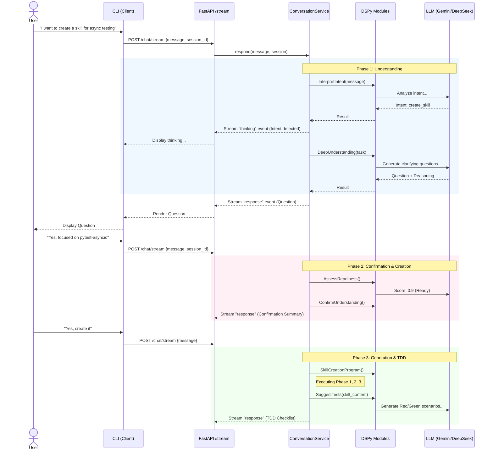
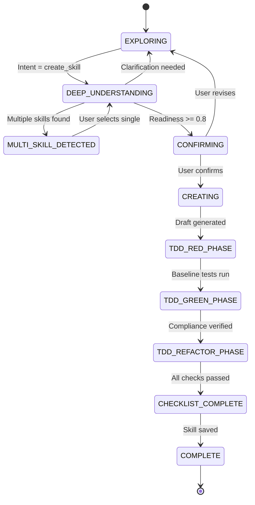

# User Flow: Interactive Skill Creation

This document outlines the user flow for the interactive skill creation process, highlighting the interaction between the CLI (Client), the FastAPI Backend, the Conversation Service, and the DSPy modules.

## Architecture Overview

The system uses an **API-First Architecture**:
1.  **CLI (Thin Client)**: Handles user input/output, connects to the API via streaming.
2.  **FastAPI Backend**: Exposes endpoints, manages session state (in-memory for MVP).
3.  **Conversation Service**: Orchestrates the state machine and business logic.
4.  **DSPy Modules**: Encapsulate specific LLM tasks (Intent, Understanding, TDD).

## User Flow Diagram

## State Machine Transition

The `ConversationService` manages the following high-level states:

## Module Organization

The DSPy modules are organized by function in `src/skill_fleet/core/dspy/modules/conversation/`:

| Module | Purpose |
| :--- | :--- |
| `intent.py` | Detect user intent (`InterpretIntentModule`) and multi-skill needs (`DetectMultiSkillModule`). |
| `understanding.py` | Gather context (`DeepUnderstandingModule`), ask questions (`GenerateQuestionModule`), and summarize (`UnderstandingSummaryModule`). |
| `tdd.py` | Generate test scenarios (`SuggestTestsModule`) and verify completion (`VerifyTDDModule`). |
| `feedback.py` | Present results (`PresentSkillModule`) and process user feedback (`ProcessFeedbackModule`). |

## Standards Alignment

### FastAPI
- **Dependencies**: Uses `Depends` for `TaxonomyManager` injection.
- **Pydantic**: Uses `BaseModel` for all request/response schemas.
- **Async**: Fully async route handlers and service methods.
- **Streaming**: Uses `StreamingResponse` with SSE format.

### DSPy
- **Declarative**: Uses `dspy.Signature` for all LLM interfaces.
- **Modular**: Logic encapsulated in `dspy.Module` classes.
- **Optimizable**: Uses `dspy.ChainOfThought` and supports `MultiChainComparison` for critical steps.
- **Typed**: Inputs/outputs are typed (e.g., `list[str]`, `bool`).
