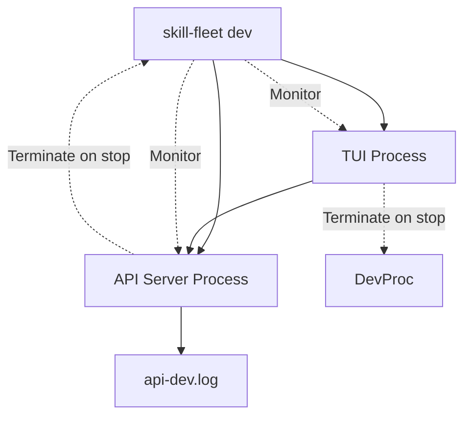
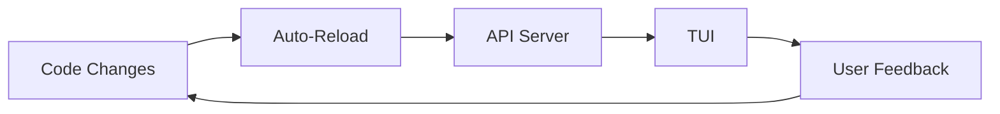

# Development Mode Command

**Last Updated**: 2026-01-20
**Command**: `skill-fleet dev`

## Overview

The `dev` command provides a streamlined development experience by starting both the **API server** and **TUI** together. This is the recommended way to develop Skills Fleet features that require API and UI integration.

`★ Insight ─────────────────────────────────────`
The `dev` command manages process lifecycle automatically: if the TUI stops, the API server is terminated, and vice versa. This ensures clean shutdown and prevents orphaned processes.
`─────────────────────────────────────────────────`

## Command Syntax

```bash
skill-fleet dev [OPTIONS]
```

## Options

| Option | Short | Default | Description |
|---------|----------|-----------|-------------|
| `--port` | `-p` | `8000` | Port to run API server on |
| `--host` | | `127.0.0.1` | Host to bind API server to |
| `--reload` | `-r` | `false` | Enable auto-reload on file changes |
| `--tui` | | `true` | Start TUI alongside API server |
| `--no-tui` | | `false` | Skip TUI, only run API server |
| `--tui-script` | | `dev` | NPM script to run for TUI |

## Usage Examples

### Basic Development Mode

Start both API server and TUI with default settings:

```bash
uv run skill-fleet dev
```

**Output:**
```
🚀 Starting Skill Fleet (API + TUI)...
API URL: http://127.0.0.1:8000
User ID: default
Reload: disabled
Waiting for API server to be ready...
💡 Tip: To enable auto-reload, use: skill-fleet dev --reload
API logs → .skill_fleet_logs/api-dev.log
```

### Custom Port and Host

Run API on different port/host:

```bash
uv run skill-fleet dev --port 9000 --host 0.0.0.0
```

**Use Cases:**
- Port conflicts with other services
- Network access from other machines
- Testing with Docker containers

### Development Mode with Auto-Reload

Enable auto-reload for hot-reloading on file changes:

```bash
uv run skill-fleet dev --reload
```

**Output:**
```
⚠️  Auto-reload enabled (in-memory jobs reset on reload)
```

**Behavior:**
- API server watches for file changes
- Automatically reloads on code changes
- ⚠️ **Warning**: In-memory job state is reset on reload
- Drafts saved to disk persist across reloads

### API Server Only (No TUI)

Run API server without TUI:

```bash
uv run skill-fleet dev --no-tui
```

**Use Cases:**
- API-only development
- Testing with external clients (curl, Postman)
- CI/CD environments

### Custom TUI Script

Run alternative TUI script:

```bash
uv run skill-fleet dev --tui-script start
```

**Use Cases:**
- Development TUI with additional debugging
- Alternative TUI implementations
- Testing different UI modes

## How It Works

### Process Management

The `dev` command manages two subprocesses:



**Lifecycle:**
1. Start API server subprocess
2. Wait for API to be ready (health check)
3. Start TUI subprocess (if enabled)
4. Monitor both processes
5. If one stops, terminate the other
6. Clean shutdown on Ctrl+C

### API Startup

```bash
uvicorn skill_fleet.api.app:app \
  --host 127.0.0.1 \
  --port 8000 \
  # --reload (if enabled)
```

**Features:**
- FastAPI application
- Uvicorn ASGI server
- Optional auto-reload for development

### Health Check

Before starting TUI, the command waits for API to be ready:

```python
def _wait_for_api_ready(url: str, timeout: float = 30.0) -> bool:
    start = time.time()
    health_url = f"{url}/docs"  # FastAPI docs endpoint
    
    while time.time() - start < timeout:
        try:
            response = requests.get(health_url, timeout=2)
            if response.status_code == 200:
                return True
        except:
            time.sleep(0.5)
    
    return False
```

**Behavior:**
- Maximum wait time: 30 seconds
- Checks every 0.5 seconds
- Warns if timeout reached (but continues)
- Uses FastAPI docs endpoint (lightweight)

### Environment Configuration

The command passes environment variables to both processes:

```bash
SKILL_FLEET_API_URL=http://127.0.0.1:8000
SKILL_FLEET_USER_ID=default
```

**Configuration Sources:**
1. Command-line options
2. Environment variables
3. `.env` file
4. Defaults

### Log Management

**API Logs:**
- Location: `.skill_fleet_logs/api-dev.log`
- Format: Plain text with timestamps
- Rotation: Manual (not automatic)

**TUI Logs:**
- Displayed in terminal
- No separate log file (uses stdout)
- Color-coded for readability

## File Structure

```
.skill_fleet_logs/
└── api-dev.log           # API server logs
```

**Log Example:**
```
INFO:     Started server process [12345]
INFO:     Waiting for application startup.
INFO:     Application startup complete.
INFO:     Uvicorn running on http://127.0.0.1:8000
```

## Auto-Reload Considerations

### Benefits
- **Hot reloading**: Changes reflected immediately
- **Faster iteration**: No manual restart needed
- **Development efficiency**: Focus on coding, not restarting

### Trade-offs
- **Job state loss**: In-memory jobs reset on reload
- **Port conflicts**: May fail if port doesn't free quickly
- **Debugging harder**: Stack traces may be less clear

### Best Practices
- Use auto-reload for UI/API changes
- Test HITL workflows without auto-reload
- Check logs after reload for errors
- Use `--no-reload` for debugging job issues

## Workflow Example

### Typical Development Session

```bash
# 1. Start development mode
uv run skill-fleet dev --reload

# 2. In another terminal, make code changes
vim src/skill_fleet/api/routes/skills.py

# 3. API auto-reloads, TUI automatically reconnects
# (no manual restart needed)

# 4. Test changes in TUI
# (create skill, run commands, etc.)

# 5. When done, Ctrl+C stops both processes
```

### Debugging API Issues

```bash
# 1. Start API without TUI
uv run skill-fleet dev --no-tui --reload

# 2. Make code changes
vim src/skill_fleet/api/routes/skills.py

# 3. Watch logs for errors
tail -f .skill_fleet_logs/api-dev.log

# 4. Test with curl
curl http://127.0.0.1:8000/docs

# 5. When fixed, start TUI
uv run skill-fleet dev
```

### Testing TUI Changes

```bash
# 1. Start in dev mode
uv run skill-fleet dev

# 2. In another terminal, rebuild TUI
cd cli/tui
npm run build

# 3. Changes reflected after rebuild
# (no restart needed if hot-reloading enabled)
```

## Troubleshooting

### Port Already in Use

**Error:**
```
Error: [Errno 48] Address already in use
```

**Solutions:**
1. Find process using port:
   ```bash
   lsof -i :8000
   ```
2. Kill the process:
   ```bash
   kill -9 <PID>
   ```
3. Use different port:
   ```bash
   uv run skill-fleet dev --port 9000
   ```

### API Not Ready in Time

**Warning:**
```
⚠️  API server didn't respond in time (may still be loading)
```

**Solutions:**
1. Wait longer (may still be loading)
2. Check API logs: `tail -f .skill_fleet_logs/api-dev.log`
3. Verify dependencies installed: `uv sync`
4. Check for import errors in logs

### TUI Not Starting

**Error:**
```
npm is required to run the TUI. Install Node.js/npm and try again.
```

**Solutions:**
1. Install Node.js: `brew install node` (macOS)
2. Verify npm: `npm --version`
3. Install TUI dependencies:
   ```bash
   cd cli/tui
   npm install
   ```

### Process Not Stopping

**Symptom:** Processes continue running after Ctrl+C

**Solutions:**
1. Kill manually:
   ```bash
   killall uvicorn
   killall node
   ```
2. Check for zombie processes:
   ```bash
   ps aux | grep uvicorn
   ps aux | grep node
   ```

### Job State Lost on Reload

**Symptom:** Job disappears after file change

**Explanation:** In-memory jobs are reset on auto-reload (expected behavior)

**Solutions:**
1. Drafts saved to disk persist
2. Promote completed drafts before reload
3. Use `--no-reload` for long-running jobs
4. Check logs for job completion before reload

### Slow Health Check

**Symptom:** Takes long time to start TUI

**Solutions:**
1. Check API logs for slow startup
2. Reduce import time in API code
3. Increase timeout in code (not configurable)
4. Use `--no-tui` to skip health check

## Integration with Other Commands

### serve Command

The `dev` command is equivalent to running:
```bash
# Terminal 1
uv run skill-fleet serve --auto-accept

# Terminal 2
cd cli/tui && SKILL_FLEET_API_URL=http://127.0.0.1:8000 npm run dev
```

But with automatic process management.

### chat Command

The TUI started by `dev` is equivalent to:
```bash
uv run skill-fleet chat
```

But with built-in API server.

### Development Workflow



## Configuration Files

### Environment Variables (`.env`)

```bash
# API Configuration
SKILL_FLEET_API_URL=http://127.0.0.1:8000
SKILL_FLEET_HOST=127.0.0.1
SKILL_FLEET_PORT=8000

# User Configuration
SKILL_FLEET_USER_ID=default

# Development Configuration
SKILL_FLEET_RELOAD=false
```

### TUI Configuration

The TUI uses npm configuration from `cli/tui/package.json`:
```json
{
  "scripts": {
    "dev": "tsx src/index.ts",
    "build": "tsc",
    "type-check": "tsc --noEmit"
  }
}
```

## Best Practices

### Starting Development
1. Always use `uv run skill-fleet dev` for development
2. Enable auto-reload for UI/API changes
3. Use `--no-reload` for debugging job issues
4. Keep terminal split: one for code, one for logs

### Code Changes
1. Save file → API auto-reloads (if enabled)
2. TUI reconnects automatically
3. Test changes immediately in TUI
4. Check logs for any errors

### Debugging
1. Check `.skill_fleet_logs/api-dev.log` first
2. Use `--no-tui` for API-only debugging
3. Use `--no-reload` for job state debugging
4. Add print statements if needed (check logs)

### Productivity Tips
1. Use terminal multiplexer (tmux, screen)
2. Watch logs in one pane
3. Edit code in another pane
4. Test in TUI in third pane

## Performance Considerations

### Startup Time
- API startup: ~2-5 seconds (depending on imports)
- Health check: Up to 30 seconds (configurable)
- TUI startup: ~1-2 seconds

### Memory Usage
- API server: ~100-200 MB (Python)
- TUI process: ~50-100 MB (Node.js)

### Auto-Reload Overhead
- Small delay (1-2 seconds) on file change
- Job state reset is main cost
- Trade-off: speed vs state persistence

## Alternatives

### Manual Setup

For more control, start processes separately:

```bash
# Terminal 1: API Server
uv run skill-fleet serve --reload

# Terminal 2: TUI
SKILL_FLEET_API_URL=http://127.0.0.1:8000
cd cli/tui && npm run dev
```

**Pros:**
- More control over each process
- Separate log streams
- Can debug independently

**Cons:**
- Manual process management
- No automatic cleanup
- More setup steps

### IDE Integration

Some IDEs can run commands directly:

**VS Code:**
1. Create `.vscode/tasks.json`
2. Add "dev" task
3. Run via Ctrl+Shift+P → Tasks: Run Task

**Example Task:**
```json
{
  "label": "Skills Fleet Dev",
  "type": "shell",
  "command": "uv run skill-fleet dev",
  "problemMatcher": []
}
```

## See Also

- **[TUI Architecture](./tui-architecture.md)** - TUI internal structure
- **[serve Command](./interactive-chat.md)** - API server command details
- **[CLI Overview](./index.md)** - All CLI commands
- **[API Documentation](../api/)** - API endpoint reference
