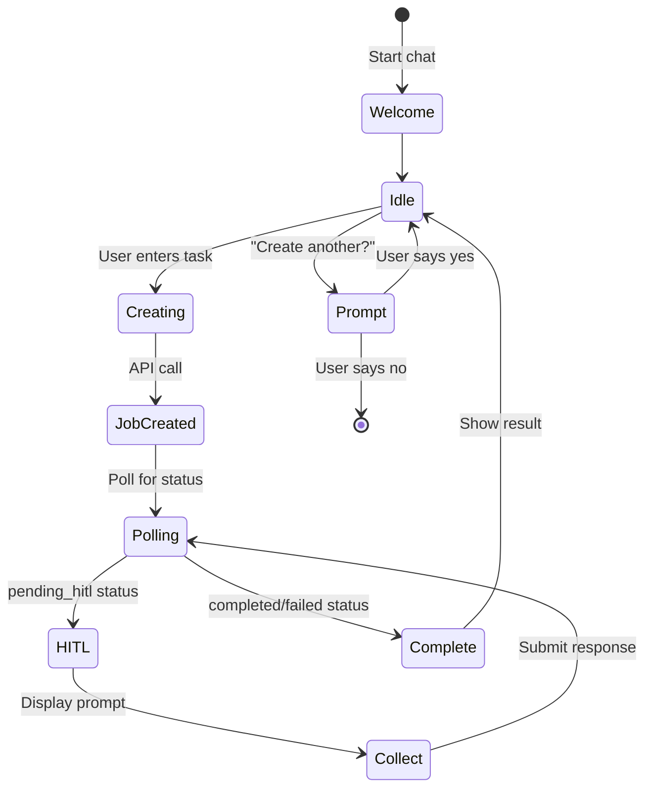

# Interactive Chat Mode

**Last Updated**: 2026-01-12
**Command**: `skill-fleet chat`

## Overview

Interactive chat mode provides a conversational interface for skill creation. Instead of a single command, you engage in a dialogue with the AI to build skills iteratively.

`★ Insight ─────────────────────────────────────`
Chat mode uses the same underlying API as the `create` command, but wraps it in a conversational loop. This allows multiple skills to be created in a single session while maintaining context and preferences.
`─────────────────────────────────────────────────`

## Starting Chat Mode

```bash
# Start chat mode
skill-fleet chat

# Start with an initial task
skill-fleet chat "Create a Python async skill"

# Auto-approve mode (no HITL prompts)
skill-fleet chat --auto-approve
```

## Chat Interface

```
╭─ Skill Fleet — Guided Creator ─────────╮
│ This command uses the FastAPI job +   │
│ HITL workflow.                          │
│ Commands: /help, /exit                  │
╰─────────────────────────────────────────╯

What capability would you like to build?
```

## Chat Commands

| Command | Alias | Description |
|---------|-------|-------------|
| `/help` | - | Show help message |
| `/exit` | `/quit` | Exit chat mode |
| `/cancel` | - | Cancel current job |

## Workflow



## HITL Interaction Types

### 1. Clarify

```
╭─ 🤔 Clarification Needed ─────────╮
│ What level of detail should this     │
│ skill cover?                         │
╰──────────────────────────────────────╯

Your answers (or /cancel):
```

**Response:** Free-form text or `/cancel`

---

### 2. Confirm

```
╭─ 📋 Understanding Summary ──────────╮
│ • Skill: Python async programming    │
│ • Target: Intermediate developers     │
│ • Path: technical_skills/python/async │
╰──────────────────────────────────────╯

Proposed path: technical_skills/python/async

Proceed? (proceed/revise/cancel) [proceed]:
```

**Options:**
- `proceed` - Continue to next phase
- `revise` - Restart current phase with feedback
- `cancel` - Cancel job

---

### 3. Preview

```
╭─ 📝 Content Preview ────────────────╮
│ ## Overview                          │
│ Python async/await provides...       │
│                                     │
│ ## Key Concepts                      │
│ - Coroutines                         │
│ - Event loops                        │
│ ...                                 │
╰──────────────────────────────────────╯

Highlights:
  • Clear explanations of async/await
  • Practical examples throughout
  • Common pitfalls covered

Looks good? (proceed/refine/cancel) [proceed]:
```

**Options:**
- `proceed` - Accept and continue
- `refine` - Request changes with feedback
- `cancel` - Cancel job

---

### 4. Validate

```
╭─ ✅ Validation Report ──────────────╮
│ Status: PASSED                        │
│                                     │
│ All checks passed:                   │
│ ✓ YAML frontmatter valid             │
│ ✓ Documentation complete             │
│ ✓ Examples present                   │
╰──────────────────────────────────────╯

Accept? (proceed/refine/cancel) [proceed]:
```

---

## Session Example

```bash
$ skill-fleet chat

╭─ Skill Fleet — Guided Creator ─────────╮
│ This command uses the FastAPI job +   │
│ HITL workflow.                         │
│ Commands: /help, /exit                  │
╰─────────────────────────────────────────╯

What capability would you like to build?
Create a Python decorators skill

🚀 Skill creation job started: abc-123-def

╭─ 🤔 Clarification Needed ─────────╮
│ What aspects of decorators should     │
│ this skill cover?                     │
╰──────────────────────────────────────╯

Your answers: Focus on practical examples, function decorators, and class decorators

╭─ 📋 Understanding Summary ──────────╮
│ • Skill: Python decorators             │
│ • Focus: Practical examples            │
│ • Topics: Function, class decorators   │
│ • Path: technical_skills/python/...    │
╰──────────────────────────────────────╯

Proceed? (proceed/revise/cancel) [proceed]: proceed

... (workflow continues)

✨ Skill Creation Completed!
📁 Skill saved to: skills/technical_skills/python/decorators

Create another skill? (y/n) [n]: y

What capability would you like to build?
```

## Auto-Approve Mode

Skip all HITL prompts for CI/CD automation:

```bash
skill-fleet chat --auto-approve
```

In auto-approve mode:
- All clarifications use empty responses
- All confirmations auto-proceed
- All previews auto-proceed
- All validations auto-accept

## Tips and Best Practices

1. **Be Specific**: More detailed task descriptions lead to better skills
2. **Use Clarifications**: The AI will ask clarifying questions—take advantage
3. **Review Previews**: The preview checkpoint shows structure before final generation
4. **Iterate**: Use `refine` to improve skills instead of starting over
5. **Batch Creation**: Create multiple related skills in one session for consistency

## Troubleshooting

### Server Not Running

```
Could not connect to API server at http://localhost:8000
Make sure the server is running:
  uv run skill-fleet serve
```

**Solution:** Start the server in a separate terminal.

### Job Timeout

```
Job ended with status: failed
Error: HITL interaction timed out
```

**Solution:** Respond to prompts within 1 hour (default timeout).

### Connection Lost

```
HTTP Error: 503 Service Unavailable
```

**Solution:** Check server status and restart if needed.

## Advanced Usage

### Piping Tasks

```bash
# Create skills from a list
cat tasks.txt | while read task; do
    echo "$task" | skill-fleet chat
done
```

### Custom Prompts

```bash
# Start with pre-defined task
skill-fleet chat "Create a $LANGUAGE skill" --auto-approve
```

## See Also

- **[CLI Overview](index.md)** - Architecture and setup
- **[Commands Reference](commands.md)** - All CLI commands
- **[CLI Architecture](architecture.md)** - Internal structure
- **[HITL System](../hitl/)** - Human-in-the-Loop details
