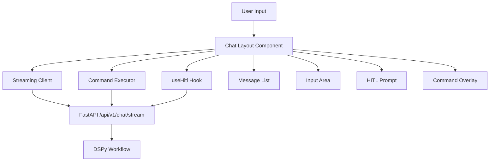
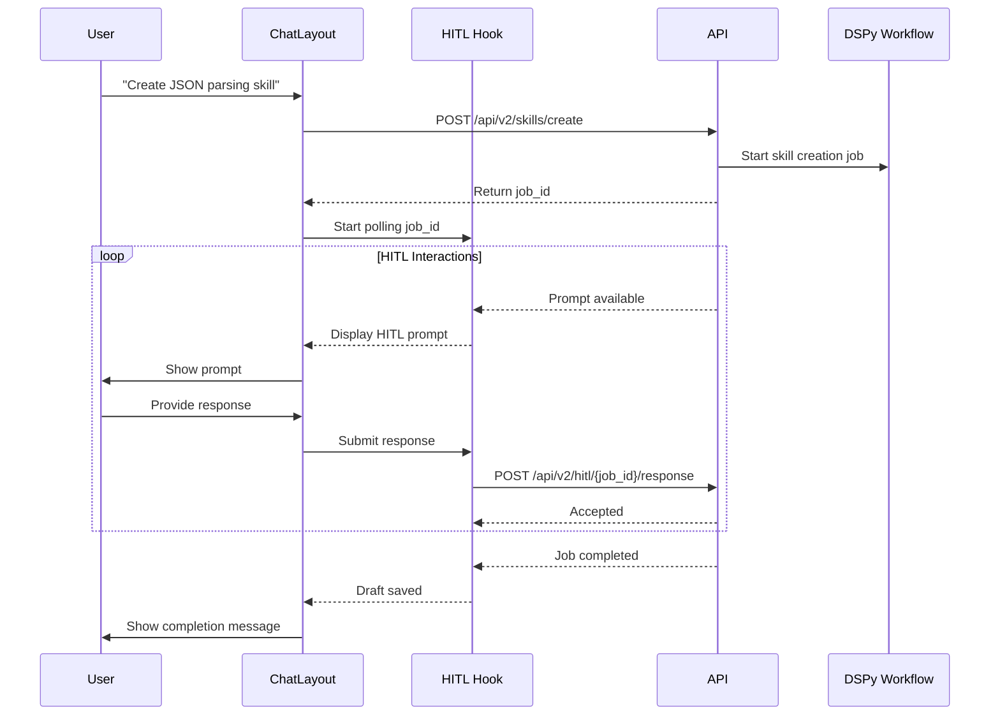
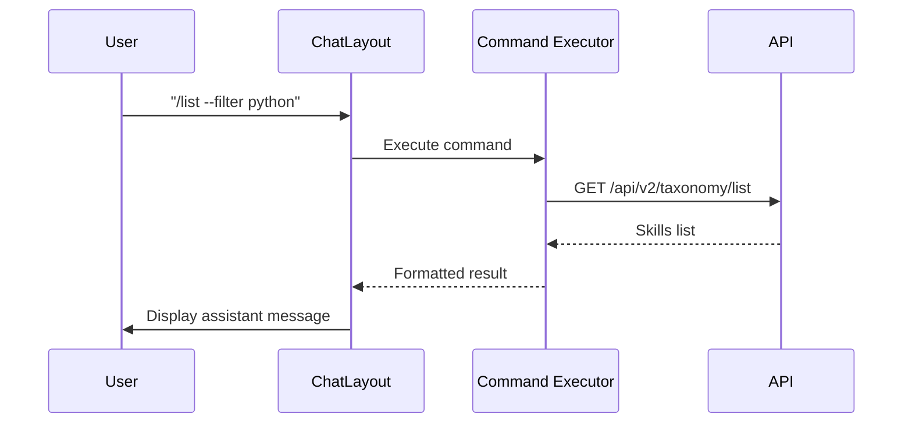
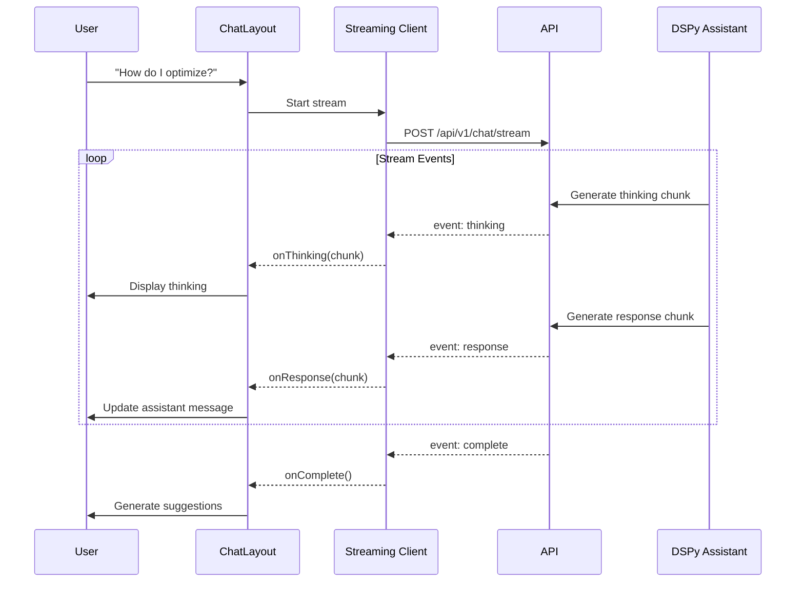

# TUI Architecture: Unified Terminal Interface

**Last Updated**: 2026-01-20
**Location**: `cli/tui/`

## Overview

The Skills Fleet Terminal User Interface (TUI) provides a unified, interactive terminal experience for skill creation, job monitoring, and workflow management. Built with **Ink.js** (React for CLI) and **TypeScript**, it offers real-time streaming responses, HITL (Human-in-the-Loop) integration, and a modern chat-based workflow.

`★ Insight ─────────────────────────────────────`
The TUI uses a **unified chat layout** approach rather than separate tabs. All interactions (skill creation, commands, job monitoring) flow through a single conversational interface with context-aware suggestions and streaming responses.
`─────────────────────────────────────────────────`

## Architecture



## Key Components

### 1. Main Application (`src/app.tsx`)

Root component that initializes TUI with API configuration:

```typescript
export const App: React.FC<AppProps> = ({ apiUrl, userId = "default" }) => {
  return (
    <Box flexDirection="column" height="100%">
      <ChatLayout apiUrl={apiUrl} />
    </Box>
  );
};
```

**Responsibilities:**
- Initialize TUI with API URL
- Provide user context to all child components

### 2. Chat Layout (`components/ChatLayout.tsx`)

**Primary interface component** managing all chat interactions:

**Features:**
- Unified message display (user, assistant, thinking, system)
- Real-time streaming responses
- HITL prompt handling
- Command execution (`/optimize`, `/list`, `/validate`)
- Main menu for quick actions
- Thinking toggle (T key)

**State Management:**
```typescript
const [messages, setMessages] = useState<Message[]>([]);
const [activeJobId, setActiveJobId] = useState<string | null>(null);
const [showThinking, setShowThinking] = useState(true);
const [showMainMenu, setShowMainMenu] = useState(true);
const [showOverlay, setShowOverlay] = useState(false);
```

**Main Menu Options:**
- Create Skill - Starts skill creation workflow
- List Skills - Browses existing skills
- Optimize - Starts DSPy optimization
- Evaluate - Evaluates skill quality

**Workflow:**
1. User enters task or selects menu option
2. Skill keywords detected → routes to HITL workflow
3. Generic request → routes to streaming chat
4. Commands → executed via CommandExecutor
5. HITL prompts → displayed and responses submitted

### 3. Streaming Client (`streaming-client.ts`)

Handles SSE (Server-Sent Events) communication with backend:

```typescript
export class StreamingClient {
  private maxRetries: number = 3;
  private retryDelayMs: number = 1000;

  async streamChat(options: StreamingOptions): Promise<void> {
    // Connects to /api/v1/chat/stream
    // Parses SSE events: thinking, response, error, complete
    // Handles retry logic (max 3 retries)
  }
}
```

**Event Types:**
- `thinking`: AI reasoning chunks (thought, reasoning, internal, step)
- `response`: Generated text chunks
- `error`: Error messages
- `complete`: Stream finished

**Retry Logic:**
- Max 3 retries with exponential backoff
- Retries only for network errors (fetch, network, ECONNREFUSED)
- Skips retry for HTTP errors (4xx, 5xx)
- Base delay: 1 second, multiplied by retry count

**SSE Parser:**
Uses `eventsource-parser` for robust event handling:
```typescript
const parser = createParser({
  onEvent: (event: EventSourceMessage) => {
    const eventType = event.event || "message";
    const data = event.data;
    
    switch (eventType) {
      case "thinking":
        onThinking(JSON.parse(data));
        break;
      case "response":
        onResponse(JSON.parse(data));
        break;
      // ...
    }
  }
});
```

### 4. HITL Hook (`hooks/use-hitl.ts`)

React hook managing Human-in-the-Loop interactions:

```typescript
export function useHitl(options: UseHitlOptions): UseHitlReturn {
  // Polls GET /api/v2/hitl/{job_id}/prompt
  // Submits via POST /api/v2/hitl/{job_id}/response
  // Manages HITL state and provides callbacks
}
```

**Features:**
- Configurable polling interval (default: 1500ms)
- Automatic polling when job is active
- Prompt change detection to avoid duplicate callbacks
- Terminal state detection (completed, failed)

**Callbacks:**
- `onComplete`: Job finished with draft path and validation score
- `onError`: Job failed with error message
- `onPrompt`: New HITL prompt received

**Polling Optimization:**
- Uses refs to avoid stale closures
- Stops polling when job reaches terminal state
- Unique prompt key detection prevents duplicate `onPrompt` calls

### 5. Message List (`components/MessageList.tsx`)

Displays messages with appropriate styling:

**Message Types:**
```typescript
interface Message {
  id: string;                    // msg-{timestamp}-{random}
  role: "user" | "assistant" | "thinking" | "system";
  content: string;
  step?: number;
  thinking_type?: string;         // "thought" | "reasoning" | "internal" | "step"
  timestamp?: string;
}
```

**Styling:**
- `user`: Cyan text with "You:" prefix
- `assistant`: Green text with "Assistant:" prefix
- `thinking`: Gray text with emoji icons
  - 💭 thought
  - 🤔 reasoning
  - ⚙️ internal
  - ▶️ step
- `system`: Magenta text for notifications

**Thinking Display:**
- Optional toggle (T key or `/think` command)
- Shows detailed AI reasoning process
- Hidden by default for cleaner output
- Filtered from messages when `showThinking` is false

### 6. Input Area (`components/InputArea.tsx`)

Text input component with command detection:

**Features:**
- Auto-detects slash commands (`/`)
- Disabled during loading
- Submits on Enter key
- Clears after submission

**Command Detection:**
When user types `/`, shows command overlay with:
- `/optimize` - Start optimization workflow
- `/list` - List skills
- `/validate` - Validate skill
- `/think` - Toggle thinking display
- `/clear` - Clear messages
- `/promote` - Promote draft
- `/status` - Check job status

### 7. HITL Prompt (`components/hitl-prompt.tsx`)

Displays HITL prompts and handles user responses:

**Prompt Types:**
```typescript
interface HITLPromptData {
  type: "clarify" | "confirm" | "preview" | "validate";
  summary?: string;
  content?: string;
  questions?: Array<{question: string, options?: string[]}>;
  current_phase?: string;
  progress_message?: string;
  draft_path?: string;
  validation_score?: number;
}
```

**Actions:**
- `proceed`: Continue workflow
- `revise`: Request changes with feedback
- `cancel`: Cancel job

**Interaction Patterns:**

1. **Clarify**: Questions to gather more information
   - Free-form text responses
   - Multiple questions possible

2. **Confirm**: Understanding summary approval
   - Options: proceed, revise, cancel
   - Shows skill details (path, type, dependencies)

3. **Preview**: Content review before generation
   - Shows draft content
   - Options: proceed, refine, cancel

4. **Validate**: Validation report review
   - Shows validation results
   - Options: proceed, refine, cancel

### 8. Command Overlay (`components/CommandOverlay.tsx`)

Autocomplete overlay for slash commands:

**Features:**
- Shows on `/` input
- Keyboard navigation with arrow keys
- Auto-fills selected command
- Closes on selection

### 9. Header (`components/Header.tsx`)

Status bar showing:
- Application title ("Skills Fleet")
- Thinking mode indicator
- Active job ID (if any)

### 10. Command Executor (`commands/executor.ts`)

Handles command execution and API communication:

**Features:**
- Execute commands via API endpoints
- Track job IDs for HITL
- Return formatted messages

**Commands:**
- `/list` → GET `/api/v2/taxonomy/list`
- `/optimize` → POST `/api/v2/optimize/start`
- `/validate` → POST `/api/v2/skills/validate`
- `/promote` → POST `/api/v2/drafts/{job_id}/promote`
- `/status` → GET `/api/v2/jobs/{job_id}`

## Workflow Integration

### Skill Creation Workflow



**Intent Detection:**
ChatLayout detects skill creation requests using keywords:
- "create skill", "make skill", "build skill"
- "new skill", "i want", "i need", "skill for"

When detected:
1. Creates job via `/api/v2/skills/create`
2. Starts HITL polling for the job
3. Displays prompts as they arrive
4. Submits user responses
5. Shows completion message with draft path

### Command Execution Workflow



### Streaming Chat Workflow



## State Management

### Message State

Messages are stored as an array with unique IDs:

```typescript
const getNextMessageId = useCallback(() => {
  const id = `msg-${Date.now()}-${Math.random().toString(36).substr(2, 9)}`;
  return id;
}, []);
```

**ID Format:** `msg-{timestamp}-{random}` ensures uniqueness even during rapid streaming.

### HITL State

```typescript
const [prompt, setPrompt] = useState<HITLPromptData | null>(null);
const [isPolling, setIsPolling] = useState(false);
const [status, setStatus] = useState<string | null>(null);
const [currentPhase, setCurrentPhase] = useState<string | null>(null);
const [progressMessage, setProgressMessage] = useState<string | null>(null);
const [error, setError] = useState<string | null>(null);
```

### Main Menu State

```typescript
const MAIN_MENU_OPTIONS: MainMenuOption[] = [
  { label: "🎯 Create Skill", value: "create", description: "..." },
  { label: "📚 List Skills", value: "list", description: "..." },
  { label: "🚀 Optimize", value: "optimize", description: "..." },
  { label: "📊 Evaluate", value: "evaluate", description: "..." },
];
```

## Keyboard Shortcuts

| Key | Action | Context |
|------|---------|----------|
| `Enter` | Submit message / command | Always active in input |
| `Ctrl+C` | Exit application | Always active |
| `T` | Toggle thinking display | When not in HITL prompt |
| `Escape` | Close overlay / return to menu | Overlay or detail view |
| `Arrow keys` | Navigate options | Select / dialog |
| `/` | Open command overlay | Input field (at beginning) |

## Installation & Build

```bash
# Install dependencies
cd cli/tui
npm install

# Build TypeScript
npm run build

# Development mode
npm run dev

# Type checking
npm run type-check
```

**Build Artifacts:**
- `dist/` - Compiled JavaScript output
- `dist/*.d.ts` - TypeScript type definitions

## Configuration

### Environment Variables

| Variable | Description | Default |
|-----------|-------------|-----------|
| `SKILL_FLEET_API_URL` | API base URL | `http://localhost:8000` |
| `SKILL_FLEET_USER_ID` | User ID | `default` |

### Package Configuration

```json
{
  "name": "skills-fleet-tui",
  "version": "0.1.0",
  "type": "module",
  "dependencies": {
    "ink": "^6.6.0",
    "ink-text-input": "^6.0.0",
    "ink-select-input": "^6.2.0",
    "ink-spinner": "^5.0.0",
    "react": "^19.0.0",
    "eventsource-parser": "^3.0.0"
  }
}
```

## Performance Considerations

### Message ID Generation
- Uses `Date.now()` + random string for uniqueness
- Prevents duplicate IDs during rapid streaming
- Timestamp-based prefix provides chronological ordering

### Polling Optimization
- HITL polls every 1500ms (configurable)
- Stops polling when job completes
- Uses refs to avoid stale closures in intervals

### Streaming Efficiency
- SSE events sent as soon as generated
- No buffering of full responses
- Client-side chunk accumulation for display

### React Re-render Optimization
- Messages sliced to last 20 visible
- Thinking chunks filtered when hidden
- Use `useCallback` for event handlers
- Avoid unnecessary re-renders with memoization

### Memory Management
- Message list grows unbounded but visible portion limited
- `/clear` command removes all messages
- Consider adding history limit in future

## Troubleshooting

### Streaming Not Working

**Symptom:** Messages not updating in real-time

**Solutions:**
1. Verify API server is running: `uv run skill-fleet serve`
2. Check network connectivity to API
3. Test SSE endpoint: `curl -N http://localhost:8000/api/v1/chat/stream -X POST -H "Content-Type: application/json" -d '{"message": "test"}'`
4. Check if firewall blocks SSE connections
5. Verify Content-Type header is `text/event-stream`

### HITL Prompts Not Appearing

**Symptom:** Job running but no prompts shown

**Solutions:**
1. Check `activeJobId` state in ChatLayout
2. Verify polling is active (check `isPolling` in useHitl)
3. Test HITL endpoint: `curl http://localhost:8000/api/v2/hitl/{job_id}/prompt`
4. Check job status: `/status {job_id}`
5. Verify job is in `pending_hitl` state

### Duplicate Messages

**Symptom:** Same message appearing multiple times

**Solutions:**
1. Check message ID generation (should be unique)
2. Verify duplicate event handling in SSE parser
3. Check if `onThinking` being called multiple times for same chunk
4. Look for race conditions in state updates

### Slow UI After Many Messages

**Symptom:** TUI becomes sluggish with conversation history

**Solutions:**
1. Message list automatically slices to last 20 visible
2. Clear messages with `/clear` command
3. Reduce polling interval if needed
4. Consider implementing virtual scrolling for large lists

### Polling Not Stopping

**Symptom:** HITL continues polling after job completion

**Solutions:**
1. Check job status in API response
2. Verify terminal state detection (`completed`, `failed`)
3. Check if `onComplete` callback is being called
4. Review `processPrompt` logic in useHitl hook

## Legacy Tabs

**Note:** The following tabs exist in the codebase but are **not actively used** in the unified layout approach:

- `chat-tab.tsx` - Superseded by ChatLayout
- `jobs-tab.tsx` - Job monitoring available via `/status` command
- `optimization-tab.tsx` - Optimization available via `/optimize` command
- `skills-tab.tsx` - Skills browsing available via `/list` command

These tabs are preserved for potential future use but are not currently displayed in the main navigation.

## Future Enhancements

### Planned Features
- [ ] Persistent conversation history
- [ ] Custom theme support (colors, styles)
- [ ] Multi-session support
- [ ] File attachment support
- [ ] Voice input integration
- [ ] Rich markdown rendering (tables, code blocks)
- [ ] Export conversation to file

### Performance Improvements
- [ ] Virtual scrolling for large message lists
- [ ] Message compression for history
- [ ] Optimized React re-renders
- [ ] Lazy component loading

### UX Improvements
- [ ] Better error recovery
- [ ] Undo/redo for messages
- [ ] Search within message history
- [ ] Richer command suggestions
- [ ] Context-aware command help

### Developer Experience
- [ ] Storybook for component testing
- [ ] E2E tests with TUI simulation
- [ ] Performance profiling
- [ ] Component-level testing

## See Also

- **[Streaming Quick Start](../STREAMING_QUICKSTART.md)** - TUI usage guide
- **[Streaming Architecture](../STREAMING_ARCHITECTURE.md)** - Backend streaming implementation
- **[Interactive Chat](./interactive-chat.md)** - CLI chat mode
- **[CLI Architecture](./architecture.md)** - CLI internal structure
- **[dev Command](./dev-command.md)** - API + TUI development mode
