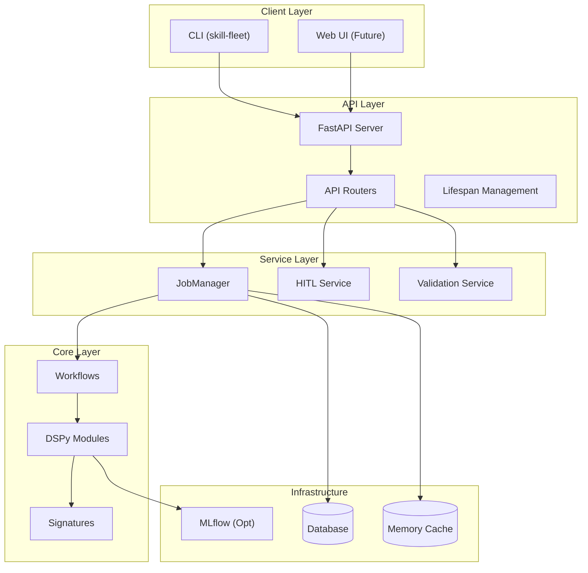
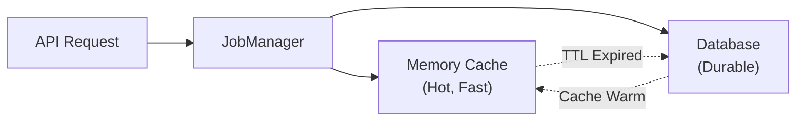
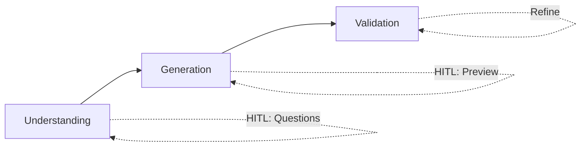
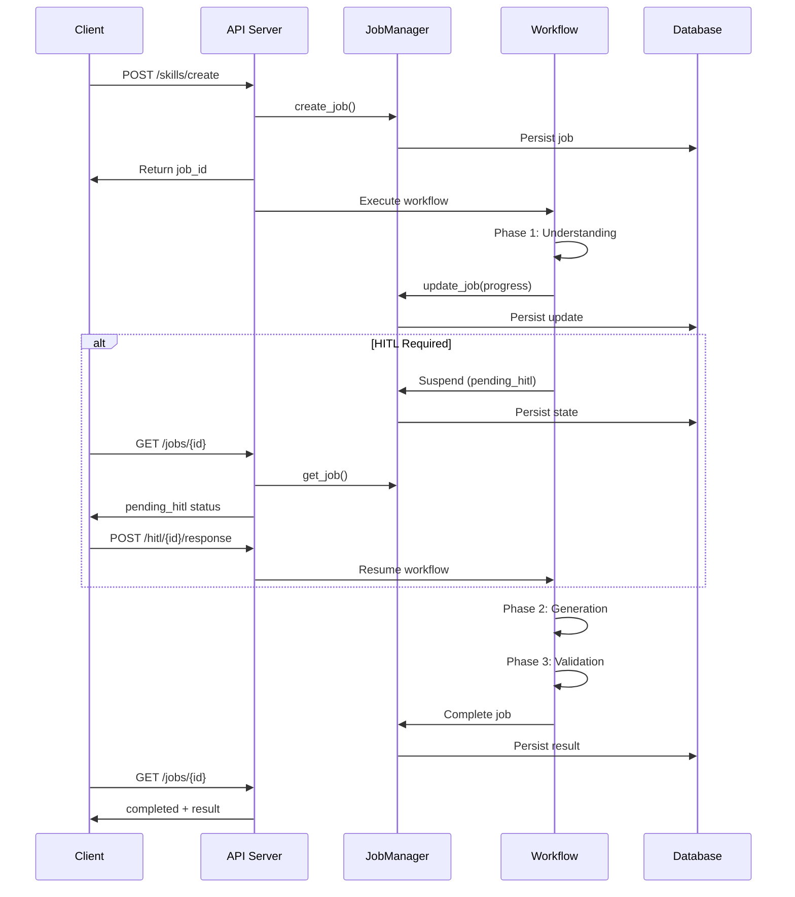

# System Architecture Overview

**Last Updated**: 2026-01-31

## Overview

Skill Fleet is a distributed system for creating, managing, and validating AI agent skills. It uses a 3-phase workflow powered by DSPy modules and supports Human-in-the-Loop (HITL) interactions.

---

## Architecture Layers

### 1. Client Layer

**CLI**: Interactive command-line interface
- `uv run skill-fleet chat` - Interactive mode with HITL
- `uv run skill-fleet create` - Non-interactive mode
- `uv run skill-fleet validate` - Skill validation
- `uv run skill-fleet promote` - Promote to taxonomy

**Web UI**: Future React-based interface (in development)

---

### 2. API Layer

**FastAPI Server** (`src/skill_fleet/api/`)

| Component | Purpose |
|-----------|---------|
| `main.py` | FastAPI app factory |
| `lifespan.py` | Startup/shutdown lifecycle |
| `routers/` | API endpoint handlers |
| `services/` | Business logic |

**Lifespan Management**:
- Initialize database tables
- Start JobManager with persistence
- Resume pending jobs from database
- Start background cleanup task
- Configure MLflow autologging (optional)

---

### 3. Service Layer

**JobManager** (`api/services/job_manager.py`)

Dual-layer persistence architecture:

| Layer | Purpose | TTL |
|-------|---------|-----|
| Memory | Fast access for in-flight jobs | 60 minutes |
| Database | Source of truth, multi-instance | Persistent |

**HITL Service** (`api/services/hitl_service.py`)

Manages human-in-the-loop interactions:
- Structure fixes
- Clarifying questions
- Content preview
- Final review

---

### 4. Core Layer

**Workflows** (`core/workflows/skill_creation/`)

**Modules** (`core/modules/`)

DSPy-powered components implementing specific capabilities:

| Phase | Module | Purpose |
|-------|--------|---------|
| 1 | GatherRequirementsModule | Extract requirements |
| 1 | AnalyzeIntentModule | Determine purpose |
| 1 | FindTaxonomyPathModule | Taxonomy placement |
| 1 | AnalyzeDependenciesModule | Identify prerequisites |
| 1 | SynthesizePlanModule | Create generation plan |
| 2 | GenerateSkillContentModule | Create SKILL.md |
| 3 | ValidateStructureModule | Check structure |
| 3 | GenerateTestCasesModule | Create test cases |
| 3 | AssessQualityModule | Quality metrics |

**Signatures** (`core/signatures/`)

DSPy signature definitions for LLM interactions.

---

### 5. Infrastructure Layer

**Database** (`infrastructure/db/`)

- SQLAlchemy models for job persistence
- Repository pattern for data access
- Transactional sessions for atomicity
- Supports SQLite (dev) and PostgreSQL (prod)

**Monitoring** (`infrastructure/monitoring/`)

Optional MLflow integration for:
- DSPy autologging
- Prompt tracking
- Metric collection

---

## Data Flow

### Skill Creation Flow

---

## Key Design Decisions

### Async-First Architecture

All workflows use async/await for performance:
- Concurrent LLM calls reduce latency
- Non-blocking I/O allows concurrent requests
- Cancellation support for long-running jobs

### Dual-Layer Persistence

Memory cache + database provides:
- Fast access for active jobs
- Durability across restarts
- Multi-instance support

### HITL State Machine

Workflows can suspend for human input:
- State persisted to database
- Jobs resume after response
- Timeout handling for abandoned jobs

### Module Composition

Small, focused modules that compose:
- Each module has single responsibility
- Signatures define clear contracts
- Easy to test and extend

---

## Scaling Considerations

| Aspect | Current | Future |
|--------|---------|--------|
| API | Single instance | Load balancer + multiple instances |
| Jobs | In-memory + DB | Redis cache + DB |
| Workflows | Asyncio | Task queue (Celery/RQ) |
| LLM | Synchronous | Batching + caching |

---

## Related Documentation

- [Workflow Engine](workflow-engine.md) - 3-phase workflow details
- [API Reference](../../reference/api/endpoints.md) - REST API
- [Core Modules](../../reference/core/modules.md) - Module implementations
