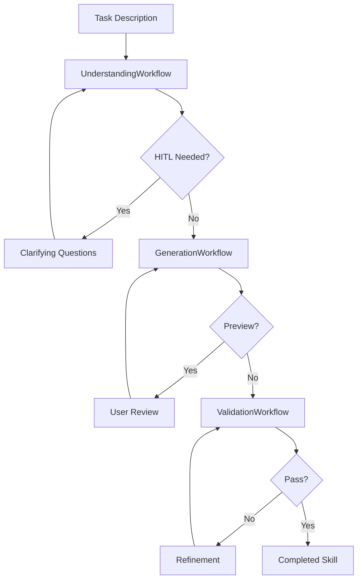
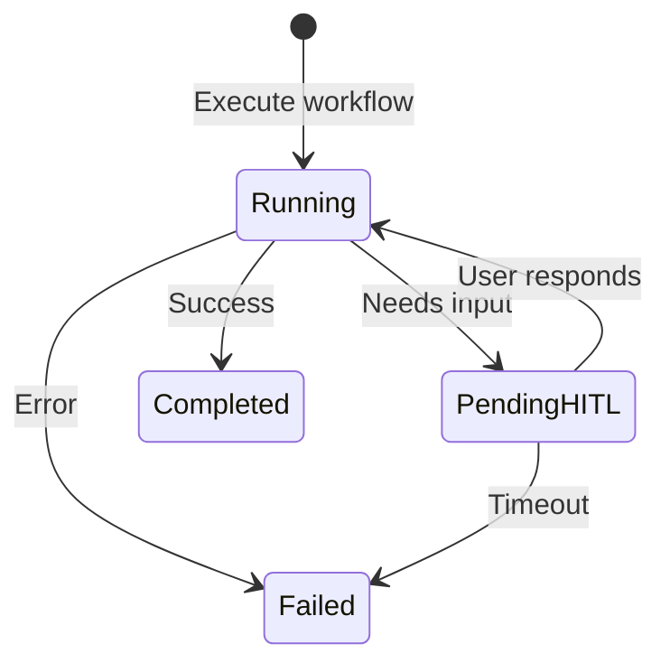

# Skill Creation Workflow Engine

**Last Updated**: 2026-01-31
**Location**: `src/skill_fleet/core/workflows/skill_creation/`

## Overview

The Skill Fleet workflow engine implements a 3-phase pipeline for creating agent skills:

1. **Understanding Phase** - Analyze requirements, intent, taxonomy placement
2. **Generation Phase** - Create skill content based on the plan
3. **Validation Phase** - Validate quality, compliance, and trigger coverage



---

## Phase 1: Understanding Workflow

**File**: `src/skill_fleet/core/workflows/skill_creation/understanding.py`
**Class**: `UnderstandingWorkflow`

### Purpose

Transforms a user's task description into a structured plan for skill creation. Gathers requirements, analyzes intent, finds the optimal taxonomy path, and identifies dependencies.

### Modules Used

| Module | Purpose | File |
|--------|---------|------|
| `GatherRequirementsModule` | Extract domain, topics, constraints | `modules/understanding/requirements.py` |
| `AnalyzeIntentModule` | Understand purpose and scope | `modules/understanding/intent.py` |
| `FindTaxonomyPathModule` | Determine taxonomy placement | `modules/understanding/taxonomy.py` |
| `AnalyzeDependenciesModule` | Identify prerequisites | `modules/understanding/dependencies.py` |
| `SynthesizePlanModule` | Combine into coherent plan | `modules/understanding/plan.py` |
| `ValidateStructureModule` | Early validation of name/description | `modules/validation/structure.py` |

### Execution Flow

```python
async def execute(task_description, user_context, taxonomy_structure, existing_skills):
    # Step 1: Gather requirements
    requirements = await self.requirements.aforward(...)

    # Step 2: Validate structure early
    structure = self.structure_validator.forward(...)
    if not structure["overall_valid"]:
        return await self._suspend_for_structure_fix(...)

    # Step 3: Run parallel analysis
    intent_future = self.intent.aforward(...)
    taxonomy_future = self.taxonomy.aforward(...)
    intent, taxonomy = await asyncio.gather(intent_future, taxonomy_future)

    # Step 4: Analyze dependencies (depends on intent)
    dependencies = await self.dependencies.aforward(...)

    # Step 5: Synthesize plan
    plan = await self.plan.aforward(...)

    return {"status": "completed", "plan": plan, ...}
```

### HITL Integration

The workflow can suspend for human input at two points:

1. **Structure Fix** - If skill name/description doesn't meet requirements
2. **Clarifying Questions** - If requirements gathering detects ambiguities

```python
# Structure fix HITL
{
    "status": "pending_hitl",
    "hitl_type": "structure_fix",
    "hitl_data": {
        "name_errors": [...],
        "description_errors": [...],
        "suggested_name": "...",
        "suggested_description": "..."
    }
}

# Clarifying questions HITL
{
    "status": "pending_hitl",
    "hitl_type": "questions",
    "hitl_data": {
        "questions": [...],
        "priority": "critical"
    }
}
```

### Output

```python
{
    "status": "completed",
    "plan": {
        "skill_name": "python-async-await",
        "skill_description": "Use when you need to...",
        "taxonomy_path": "technical/programming/python/async",
        "content_outline": [...],
        "generation_guidance": "...",
        "success_criteria": [...],
        "trigger_phrases": [...],
        "negative_triggers": [...],
        "skill_category": "document_creation"
    },
    "requirements": {...},
    "intent": {...},
    "taxonomy": {...},
    "dependencies": {...}
}
```

---

## Phase 2: Generation Workflow

**File**: `src/skill_fleet/core/workflows/skill_creation/generation.py`
**Class**: `GenerationWorkflow`

### Purpose

Generates complete SKILL.md content based on the plan from Phase 1. Uses category-specific templates and can show previews for user feedback.

### Modules Used

| Module | Purpose | File |
|--------|---------|------|
| `GenerateSkillContentModule` | Create SKILL.md content | `modules/generation/content.py` |

### Execution Flow

```python
async def execute(plan, understanding, enable_hitl_preview, skill_style):
    # Generate content
    content = await self.content_generator.aforward(
        plan=plan,
        understanding=understanding,
        skill_style=skill_style
    )

    # Optional: Show preview for feedback
    if enable_hitl_preview:
        return {
            "status": "pending_hitl",
            "hitl_type": "preview",
            "hitl_data": {
                "skill_content": content["skill_content"],
                "sections_count": ...,
                "examples_count": ...
            }
        }

    return {"status": "completed", "skill_content": ...}
```

### Template System

Content generation uses category-specific templates:

| Category | Template Focus |
|----------|---------------|
| `document_creation` | Output format, style guidelines, examples |
| `workflow_automation` | Workflow steps, input/output, error handling |
| `mcp_enhancement` | MCP tools, tool sequences, error recovery |
| `analysis` | Analysis patterns, output formats, confidence |

### HITL Integration

The preview HITL allows users to review and provide feedback:

```python
{
    "status": "pending_hitl",
    "hitl_type": "preview",
    "hitl_data": {
        "skill_content": "# Skill\n...",
        "sections_count": 8,
        "examples_count": 5,
        "reading_time": 12
    },
    "context": {
        "plan": plan,
        "understanding": understanding,
        "skill_style": skill_style
    }
}
```

### Output

```python
{
    "status": "completed",
    "skill_content": "# Skill Name\n\nUse when...",
    "sections_generated": ["Introduction", "Examples", "..."],
    "code_examples_count": 5,
    "estimated_reading_time": 12
}
```

---

## Phase 3: Validation Workflow

**File**: `src/skill_fleet/core/workflows/skill_creation/validation.py`
**Class**: `ValidationWorkflow`

### Purpose

Validates generated skill content for compliance with agentskills.io standards, quality metrics, and trigger phrase coverage.

### Modules Used

| Module | Purpose | File |
|--------|---------|------|
| `ValidateStructureModule` | Name, description, security checks | `modules/validation/structure.py` |
| `GenerateTestCasesModule` | Create positive/negative test cases | `modules/validation/test_cases.py` |
| `ValidateComplianceModule` | agentskills.io compliance | `modules/validation/compliance.py` |
| `AssessQualityModule` | Quality scoring, size, verbosity | `modules/validation/compliance.py` |
| `RefineSkillModule` | Auto-fix issues | `modules/validation/compliance.py` |

### Execution Flow

```python
async def execute(skill_content, plan, taxonomy_path, enable_hitl_review, quality_threshold):
    # Step 0: Structure validation
    structure = self.structure_validator.forward(...)

    # Step 1: Generate test cases
    test_cases = self.test_generator.forward(...)

    # Step 2: Compliance check
    compliance = await self.compliance.aforward(...)

    # Step 3: Quality assessment
    quality = await self.quality.aforward(...)

    # Step 4: HITL review (optional)
    if enable_hitl_review:
        return self._create_review_checkpoint(...)

    # Step 5: Refine if needed
    if quality["overall_score"] < quality_threshold:
        refined = await self.refinement.aforward(...)
        return {"status": "refined", "skill_content": refined["refined_content"]}

    return {"status": "completed", "validation_report": {...}}
```

### Quality Metrics

The workflow assesses multiple quality dimensions:

| Metric | Target | Description |
|--------|--------|-------------|
| `overall_score` | >= 0.75 | Weighted aggregate score |
| `completeness` | High | Coverage of plan requirements |
| `clarity` | High | Readability and organization |
| `word_count` | < 5000 | Size recommendation |
| `size_assessment` | optimal/acceptable | Size classification |
| `verbosity_score` | < 0.5 | Conciseness measure |
| `trigger_coverage` | >= 0.9 | Test case coverage |

### Test Case Generation

Automatically generates test cases for validation:

```python
{
    "positive_tests": ["How do I create...", "Build a..."],
    "negative_tests": ["How to use Vue...", "Angular..."],
    "edge_cases": ["What about Python 2..."],
    "functional_tests": ["Given X, should produce Y"]
}
```

### HITL Integration

Review checkpoint for human approval:

```python
{
    "status": "pending_hitl",
    "hitl_type": "review",
    "hitl_data": {
        "skill_content_preview": "...",
        "compliance_score": 0.92,
        "quality_score": 0.88,
        "strengths": [...],
        "weaknesses": [...]
    }
}
```

### Validation Report

```python
{
    "status": "completed",
    "passed": True,
    "validation_report": {
        "passed": True,
        "score": 0.88,
        "errors": [],
        "warnings": [...],
        "checks_performed": [
            "structure_validation",
            "agentskills.io_compliance",
            "quality_assessment",
            "test_case_generation"
        ],
        "structure_valid": True,
        "test_cases": {...},
        "trigger_coverage": 0.95,
        "word_count": 2500,
        "size_assessment": "optimal",
        "verbosity_score": 0.3
    }
}
```

---

## HITL State Machine

All three workflows support Human-in-the-Loop interactions:



### HITL Types

| Type | Phase | Purpose |
|------|-------|---------|
| `structure_fix` | Understanding | Fix name/description issues |
| `questions` | Understanding | Clarify ambiguities |
| `preview` | Generation | Review content before finalizing |
| `review` | Validation | Approve final skill |

### Resume Pattern

When a workflow suspends for HITL:

1. Return `pending_hitl` status with `hitl_data`
2. Store context for resumption
3. API stores response via `POST /hitl/{job_id}/response`
4. Job manager resumes workflow with user input
5. Workflow continues from suspension point

---

## Async Architecture

All workflows use async/await for performance:

```python
# Parallel execution where possible
intent_future = self.intent.aforward(...)
taxonomy_future = self.taxonomy.aforward(...)
intent, taxonomy = await asyncio.gather(intent_future, taxonomy_future)

# Sequential for dependencies
deps = await self.dependencies.aforward(...)  # Needs intent result
plan = await self.plan.aforward(...)          # Needs all previous
```

Benefits:
- **Concurrent LLM calls** - Reduces total latency
- **Non-blocking I/O** - Server can handle other requests
- **Cancellation support** - Jobs can be cancelled mid-flight

---

## Error Handling

Each phase has specific error handling:

### Understanding Errors
- Invalid task description → Return clarification request
- Ambiguous requirements → HITL questions
- Structure validation fail → HITL structure fix

### Generation Errors
- Content generation fail → Retry with different parameters
- Template mismatch → Fallback to generic template

### Validation Errors
- Compliance fail → Auto-fix or return for manual edit
- Quality below threshold → Refinement loop (max 3 iterations)

---

## Configuration

Workflow behavior can be configured:

```python
# Understanding
enable_hitl_clarification: bool = True
structure_validation_early: bool = True

# Generation
enable_hitl_preview: bool = False
skill_style: str = "comprehensive"

# Validation
quality_threshold: float = 0.75
enable_hitl_review: bool = False
max_refinement_iterations: int = 3
```

---

## Related Documentation

- [Core Modules Reference](../../reference/core/modules.md) - Module implementations
- [HITL System](hitl-system.md) - Human-in-the-Loop architecture
- [API Jobs Reference](../../reference/api/jobs.md) - Job-based execution
- [Getting Started](../../tutorials/getting-started.md) - End-to-end tutorial
